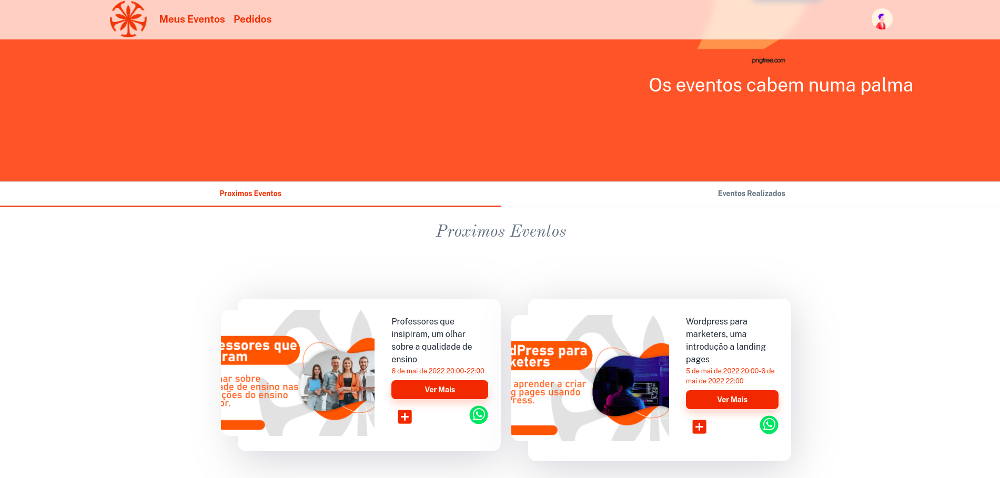
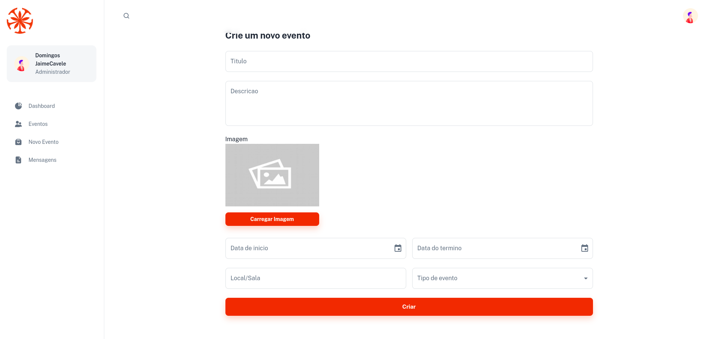

## IEvents [(Visit)](https://minimal-kit-react.vercel.app/)

> IEvents - school management events system.

# School Event Management (IEvents)

IEvents is platform to manage school events, built to help universities to manage their events

## Getting started

- Recommended `node js 14+` and `npm 6+`
- Install dependencies: `npm install` or `yarn install`
- Start the server: `npm run start` or `yarn start`
## 

## Page demo

- [HomePage](http://iscimevents.netlify.app/)

## Contributing
Pull requests are welcome. For major changes, please open an issue first to discuss what you would like to change.

Please make sure to update tests as appropriate.

## License
[MIT](https://choosealicense.com/licenses/mit/)

## Contact me

Email me: domingoscavele01@gmail.com